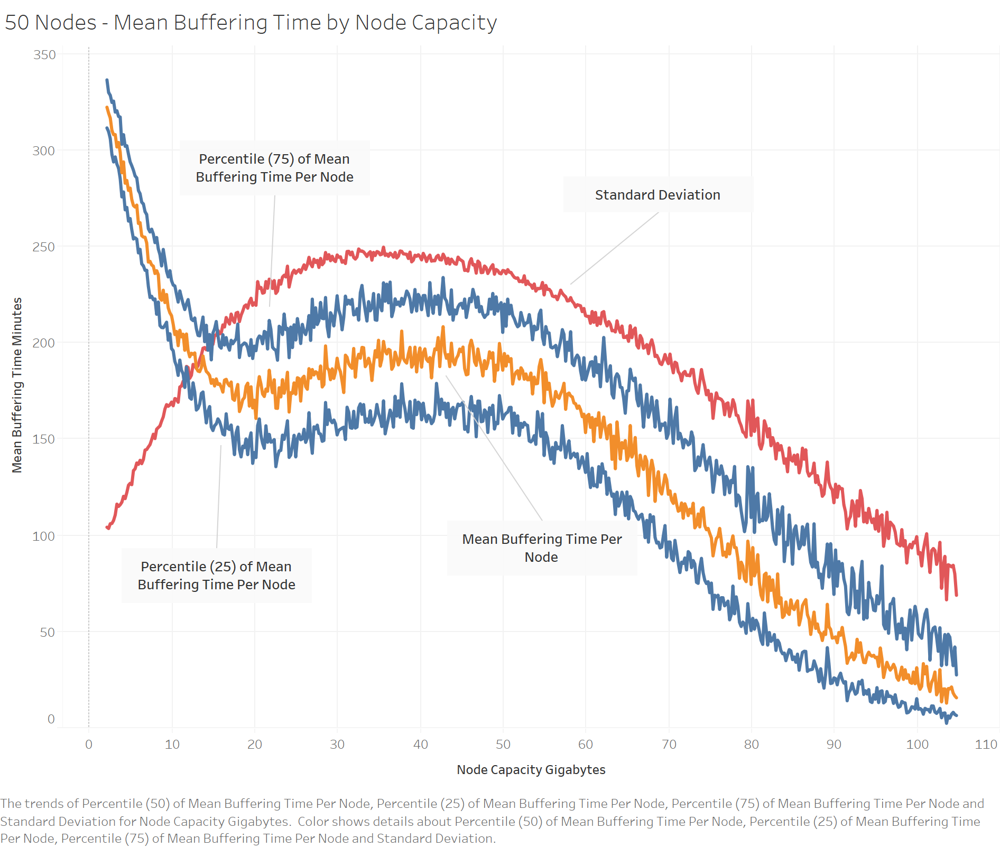

# CDA6122 Fall 2019 Project

Authors: David Bruck (dbruck1@fau.edu) and Freguens Mildort (fmildort2015@fau.edu)  
Original source: https://github.com/CDA6122/Project  
License: BSD 2-Clause License (https://opensource.org/licenses/BSD-2-Clause)


## Abstract

This simulation project explores cross-layer optimizations in wireless ad-hoc networks for improving quality of service (QoS) in content distribution. By storing multiple copies of the same content distributed amongst an array of interconnected nodes, we can analyze the effects of storing additional copies of the same content on the QoS. For model simplification we are using a circle network where each interconnected node can only talk to its nearest neighbor in each direction clockwise or counterclockwise. We will use continuous random variables across multiple simulation runs, some following a Markov process with a Poisson distribution for when a nodes initially request content, and others Gaussian random like the likelihood particular content will be requested (popularity) and the file size of the content. QoS will be measured by the average amount of time between when a node makes the initial request for content and when enough of the content has buffered so the remainder could be streamed without stopping.


## Table of Contents

1. [Introduction](#introduction)
2. [Simulation Parameters](#simulation-parameters)
3. [Quick Run](#quick-run)
4. [Download, Compile, and Run](#download-compile-and-run)
   - [Prerequisites](#prerequisites)
   - [Verify Prerequisites](#verify-prerequisites)
   - [First time instructions](#first-time-instructions)
   - [Then, to run it the first time and every time afterwards](#then-to-run-it-the-first-time-and-every-time-afterwards)
5. [Build for Release](#build-for-release)
6. [How we did it](#how-we-did-it)
7. [Results / Conclusion](#results-and-conclusion)
8. [Bibliography](#bibliography)


## Introduction

We wanted to show the benefits of cross-layer ad-hoc networks for multimedia consumption versus traditional-layer networks.

We are proposing content distribution as one such cross-layer optimization. Our analysis will show the cost tradeoffs of additional node resources, specifically storage capacity, versus additional quality of service.

This research is inline with other research done in the field by Le T. Anh, et. al who analyzed the cost for application layer multicast of multimedia delivery, also over wireless technologies (Le T. Anh 2015[^application-layer-multicast-of-multimedia-delivery]). Their research focused on scalable video coding which differs from our simulation since we chose constant bitrate playback for ease of modeling.

We are simulating with a single wireless channel with speeds consistent with 802.11b wireless protocol. These parameters were already shown to have a best-case bandwidth over N hops of the inverse of the number of hops, or `1 / N` (Strix Systems 2005[^solving-the-wireless-mesh-multi-hop-dilemma]). We chose to use their best-case bandwidth scenario which will make our results less pronounced for additional QoS per node storage capacity since we are also only simulating with a single wireless channel, which makes our results more pronounced. The goal being to partially balance out these over-simplifications.

The *Project* is a simulator with a graphical user interface based in web technologies which runs locally (with an embedded web server). We added the user interface for presentation purposes. 

The *Project* includes the code for performing an event-based (not real-time) simulation. We are using Math.NET Numerics[^math.net-numerics] package for its Gaussian random distributions. 

The *Project* also includes the code for analyzing the results returned from the simulator to get the mean buffering time and its standard deviation.

There is another console application, *BulkRunner*, whose source is included in a source code subfolder of the same name. We used it to repeatedly run the simulation over a range of parameter inputs for bulk data analysis. It is not part of the distributed releases for *Project* and has to be compiled from source as needed.

### Simulation Events

Simulated nodes request files for streaming randomly at a mean time interval (λ) following a normal approximation to Poisson distribution (μ, or the mean, equals λ and σ, or the standard deviation, equals the square root of λ). We chose to use a normal approximation to Poisson instead of the Poisson distribution included in Math.NET Numerics package since it only provided discrete event samples (integers), but random event times should follow a continuous distribution. With enough gaussian random samples, the normal approximation to Poisson distributes similarly.

### Simulation Files

A controllable number of simulated files are produced. We are using a continuous gaussian random distribution to determine the files' sizes as well as their relative popularity to be chosen both for streaming and for content distribution to the indivual nodes' local storage. The number of files available for streaming times the average file size is the average total file catalog file size. We are only simulating node storage capacities with a minimum range of that required for the sum of all nodes' capacity to be able to contain the average total file catalog file size. This means with more nodes, we can allocate a lower minimum storage capacity per node. On the higher end, we do not simulate a storage capacity per node greater than the average total file catalog file size since if every node contains every file locally, there will be no wireless network access as files can be streamed from local storage.


## Simulation Parameters

Our simulation has the ability to control the following simulation parameters with specified default values:

- Number of nodes (N). Default: 6.
- The length of time for for each simulation run. Default: 600 minutes.
- Number of files requested per node (1 / λ). Default: 60. Represents a λ of 10 minutes mean time between events.
- Mean file size. Default: 357.628 MB. Represents the size calculated for the average file to take 10 minutes to play back.
- File size standard deviation. Default: 150 MB.
- Playback constant bitrate. Default: 5,000,000 bits/second.
- Storage capacity per node allocated to storing distributed files. Default: 20 GB.
- Single-channel wireless bandwidth (represents peak speed for 1 hop, no contention). Default: 24 megabits/second.
- Number of files in the catalog for random distribution to the nodes. Default: 300. Important note: because the files are assigned a random popularity and the distribution of the files to the nodes follows the same popularity, some files may not be selected for distribution. We are also preventing a node from requesting a file to stream which has not been distributed to at least one node on the network.
- File popularity standard deviation. Default: 0.004.
- Max sampling attempts to ensure all catalog files have been distributed, with each file on at least one node. Default: 100.
- How many times the simulation will be run. Default: 1. Results will be averaged in analysis if this number is increased. Our published results did not change this parameter. Instead they used every simulation result independently for quartile analysis (25th percentile, mean, 75th percentile).


## Quick Run

Follow these instructions if you just want to run the pre-compiled releases.

### Releases

In the Releases tab on the GitHub CDA6122 Project page for each release version, you will see a set of files by different Operating System. The ‘packed’ file is sufficient to run the application, but all files produced by `electronize build` will be provided in addition. The ‘blockmap’ file is a gzipped JSON file listing the application files with indexes and content hashes. ‘latest.yml’ file describes basic information about the release including the version, the files, the release date, and content hashes. The ‘unpacked’ file is a zip file was created by packing the unpacked output folder.
**You only need to download the packed file to run the application.*

* Windows[^windows]
  * `Project Setup [version].exe` **packed application, for installation*
  * `Project Setup [version].exe.blockmap`
  * `latest.yml`
  * `win-unpacked.zip`
* OSX[^macos]
  * `Project-[version].dmg` **packed application, for installation*
  * `Project-0.0.1.dmg.blockmap`
  * `latest-mac.yml`
  * `Project.app` **packed application*
  * `Project-[version]-mac.zip`
* Linux[^linux]
  * `Project-[version].AppImage` **packed application*
  * `electron.net.host_[version]_amd64.snap` **packed application, for installation*
  * `latest-linux.yml`
  * `linux-unpacked.tar.gz`


## Download, Compile, and Run

Follow these instructions if you want to view the project source, or make changes and test them.

### Prerequisites

1. Install git for your current Operating System.
   *During installation, if prompted, choose to add its path to your environment with option like “`Git from the command line and also from 3rd-party software`”*
   https://git-scm.com/downloads
2. Install .NET Core 2.2 SDK for your current Operating System from:
   https://dotnet.microsoft.com/download/dotnet-core/2.2
3. Install .NET Core 3.0 SDK for your current Operating System from:
   https://dotnet.microsoft.com/download/dotnet-core/3.0
4. Install Node.js (can use LTS version):
   https://nodejs.org/en/

### Verify Prerequisites

Open a new terminal and ensure the following executables can be found (can use ‘`where`’ on Windows or ‘`whereis`’ on Linux):
`git` (e.g. “`where git`” on Windows)
`npm` (e.g. “`whereis dotnet`” on Linux)

In the terminal, run the following command and ensure it lists at least the two lines starting 3.0.X and 2.2.X (X can be anything):  
`dotnet --list-sdks`

In the terminal, change directory to the desired parent directory which will contain the Project subdirectory (containing the Project source code).
Follow instructions from the GitHub CDA6122 Project page to Clone or download. For example, you can use the following terminal command:  
`git clone https://github.com/CDA6122/Project.git`

### First time instructions

In the terminal, change directory to the Project subfolder.
Run the following commands (omit the “sudo” command prefix if running on Windows; also, installing electron-builder seems to take a very long time so be patient):  
`dotnet tool install ElectronNET.CLI -g`  
`sudo npm install electron-builder --global`  

**Note:** *You may have to restart the computer if terminal says `electronize` command not found when you try to run it*

### Then, to run it the first time and every time afterwards

In the terminal, change directory to the Project subfolder
Run the following command:  
`electronize start` 


## Build for Release

Follow these instructions if you want to build a release such as for the [Quick Run](#quick-run).
*First, follow the instructions for [Download, Compile, and Run](#download-compile-and-run), if you haven't already*

First, delete all files in the build output directory like: [source_root]/bin/Desktop/*

Open a new terminal, change directory to the Project subfolder, and run only the one following command appropriate for the desired Operating System target (the first time running the command may take a while so be patient):

1. `electronize build /target win` *build for Windows is supported cross-platform, but requires wine to be installed*[^wine]
2. `electronize build /target osx` *build for macOS is supported only on macOS, please see https://electron.build/multi-platform-build**

**Note:** *Building on macOS may give some errors. Provided are some common errors and resolutions. After attempting each resolution, try the build again:*

- Error: ‘`electron-builder update check failed`’
  Resolution: follow the instructions to ‘`get access to the local update config store`’
- Error (if the exact path to directory `/Users/davidbruck/.npm/_cacache/index-v5` differs in the error message, change it in the resolution command as well):  
```shell
  ⨯ npm exited with code ERR_ELECTRON_BUILDER_CANNOT_EXECUTE
Error output:
Error output:
Unhandled rejection Error: EACCES: permission denied, mkdir '/Users/davidbruck/.npm/_cacache/index-v5/f9/55'
```
​       Resolution:  
```shell
sudo chmod -R g+w /Users/davidbruck/.npm/_cacache/index-v5
```

3. `electronize build /target linux` *build for Linux is supported cross-platform (i.e. from Windows as well), but requires the free https://service.electron.build/find-build-agent to be available which, at the time of this writing, was not*

**Note:** *Building on Linux may give some errors. Provided are some common errors and resolutions. After attempting each resolution, try the build again:*

- Error: ‘`electron-builder update check failed`’
  Resolution: follow the instructions to ‘`get access to the local update config store`’
- Error (if the exact path to directory `/usr/lib/node_modules/electron-builder/node_modules/app-builder-lib/templates/icons` differs in the error message, change it in the resolution command as well):  
```shell
  ⨯ chmod /usr/lib/node_modules/electron-builder/node_modules/app-builder-lib/templates/icons/electron-linux/256x256.png: operation not permitted
```
​       Resolution:  
```shell
sudo find /usr/lib/node_modules/electron-builder/node_modules/app-builder-lib/templates/icons -type d -user root -exec sudo chown -R $USER: {} +
```


## How we did it

1. First, we picked HTML/CSS for the presentation layer.[^htmlcss]
2. Second, we picked C# to drive changes to the presentation layer (instead of JavaScript) and to perform the simulation itself. (C#)[^ecma334] (JavaScript)[^ecma262]
3. Tools (all cross-platform):
   1. Electron was used as a way to bundle Chromium for rendering the HTML/CSS. It runs as a Desktop application.[^electron] [^chromium]
   2. Normally, Electron has a JavaScript API for controlling application logic, but we used Electron.NET so we can use .NET Core to serve an in-process web application instead of Node.js or others.[^electronnet]
   3. Electron uses Node.js as an additional runtime and Electron.NET also uses npm packages such as for ElectronHostHook.[^nodejs]
   4. Electron.NET works on .NET Core 2.2, but we are using it to host a web application on .NET Core 3.0 (hence two different versions in the required dependencies).[^dotnet]
   5. .NET Core 3.0 includes support for Blazor Server which allows us to drive changes to the presentation layer in C# instead of JavaScript.[^blazor]
4. The pre-compiled build outputs are also cross-platform, but required all platforms to create them.


## Results and Conclusion

Except for altering the simulation parameter for storage capacity per node (our independent variable), we ran the first simulation using only the [default simulation parameters](#simulation-parameters). This represents 6 simulated nodes on the network. Also, at each value for storage capacity, the simulation was run 100 times so we can do a quartile analysis.


For the second simulation, we overrode an additional simulation parameter to set the number of nodes to 50. Once again, the simulation was run 100 times at each storage capacity.



The 6 nodes simulation shows a very clear trend of decreased mean buffering time (increased QoS) with the increase of storage capacity, until almost no files had to be buffered (zero buffering time). Doubling from the minimum storage capacity to hold the entire average file catalog file size (about 17.5 GB) to 35 GB decreased the mean buffering time from approximately 180 minutes to 110 minutes, a 39% improvement. Doubling again to 70 GB brings the mean buffering time down to zero.

However, simulating with 50 nodes instead shows a more complex trend. At low storage capacities, the increase of additional storage capacity has a great positive impact on decreasing mean buffering time/increasing QoS. Going from the minimum storage capacity of about 2 GB to 10 GB, the mean buffering time decreases from approximately 320 minutes to 200 minutes, or a 38% improvement. We can see that with more nodes (50 versus 6), and around the minimum storage capacities for each node, we get the same approximate ratio of improvement (~38%) for far less additional storage (8 GB for 50 nodes versus 17.5 GB for 6 nodes). After this point for the 50 nodes simulation, additional increases in storage capacity do not make a considerable impact on mean buffering time until it reaches about 50 GB. Increases from 50 GB to the maximum then show a clear trend of decreased mean buffering time with the increase in storage capacity.

We can see that as content distribution is applied to larger and larger networks (more nodes). Each node will see a greater benefit in QoS for additional storage capacity allocated to content distribution. Also, we can see that the benefits may taper off at some point and it may no longer be as cost-effective to add additional storage capacity to achieve higher QoS.


## Bibliography

[^application-layer-multicast-of-multimedia-delivery]: Le, T.A., Nguyen, H. & Nguyen, M.C. “Application-network cross layer multi-variable cost function for application layer multicast of multimedia delivery over convergent networks”. Wireless Networks (2015) 21: 2677. https://doi.org/10.1007/s11276-015-0940-1  

[^solving-the-wireless-mesh-multi-hop-dilemma]: “Solving the Wireless Mesh Multi-Hop Dilemma.” (2005). Whitepaper. Strix Systems. http://www.strixsystems.com/products/datasheets/strixwhitepaper_multihop.pdf  

[^math.net-numerics]: https://numerics.mathdotnet.com/  
[^windows]:  http://microsoft.com/windows  
[^macos]: https://www.apple.com/macos  
[^linux]: https://www.kernel.org/  
[^wine]:  https://www.winehq.org/  
[^htmlcss]:  https://www.w3.org/standards/webdesign/htmlcss.html  
[^ecma334]:  https://www.ecma-international.org/publications/standards/Ecma-334.htm  
[^ecma262]:  https://www.ecma-international.org/publications/standards/Ecma-262.htm  
[^electron]: https://electronjs.org/  
[^chromium]: https://www.chromium.org/  
[^electronnet]: https://github.com/ElectronNET/Electron.NET  
[^nodejs]: https://nodejs.org/  
[^dotnet]: https://dotnet.microsoft.com/  
[^blazor]: https://docs.microsoft.com/en-us/aspnet/core/blazor


### Code Bibliography

The *Project* source code makes use of some algorithms/content we did not write/create ourselves. Each is used under license:

Musser, Joseph. Comment on “Binary search for IList\<T> and IReadOnlyList\<T>”. *GitHub*, 24 July 2017, 9:54PM EDT, https://github.com/dotnet/corefx/issues/4697#issuecomment-317605600.

Jones, Kevin. .NET Core System.Security.Cryptography.RandomNumberGenerator.GetInt32 (pull request #31243) source code. https://github.com/dotnet/corefx/pull/31243.

Albrecht, Conrad and Portman, Wills. Answer to “How to generate a cryptographically secure Double between 0 and 1?”. *Stack Exchange*, 18 May 2010, 4:50PM, https://stackoverflow.com/questions/2854438/how-to-generate-a-cryptographically-secure-double-between-0-and-1#answer-2854635.

Hardy, Michael. Answer to “Ноw many equal circles can be placed around a circle?”. *Stack Exchange*, 14 January 2013, 4:33PM, https://math.stackexchange.com/questions/278642/%D0%9D%D0%BEw-many-equal-circles-can-be-placed-around-a-circle#answer-278666.

Florida Atlantic University. University Logo. Web. 25 November 2019, http://www.fau.edu/publicaffairs/branding/history.php.